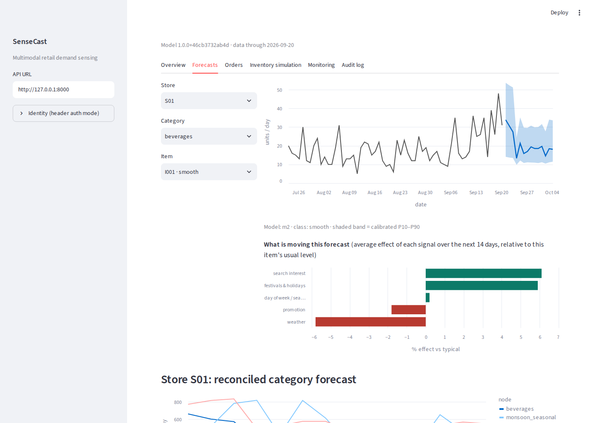
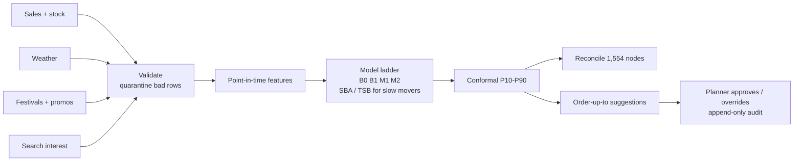

# SenseCast

**Multimodal retail demand sensing from sales, weather, events and search trends.**
BDS-32 capstone, T.Y. B.Sc. Data Science, Semester V.

SenseCast forecasts every item in every store 1 to 14 days ahead from sales, weather, Indian festivals,
promotions and search interest. It attaches a calibrated uncertainty band, reconciles the forecasts
across a 5-level hierarchy, and turns them into order suggestions a planner approves, overrides or
rejects, with every decision audited.



## Results (test block: 19 Jul to 20 Sep 2026, 1,500 item-stores)

| | SenseCast | Baseline |
|---|---|---|
| Forecast error (WAPE) | **0.407** | 0.595 seasonal naive, 0.481 planner-style |
| Error on festival and heavy-rain days, multisource vs sales-only model | **0.414** | 0.506 |
| Quantile (pinball) loss | **1.477** | 1.714 planner intervals |
| Inventory needed for a 95% fill rate | **1.96 days of cover** | 3.23 manual policy (39% less stock) |
| Stockout days at default settings | **3.0%** | 7.7% manual policy |
| API p95 latency (8 concurrent clients) | 149 ms | gate 300 ms |
| Full pipeline, 2-core laptop | 5.4 min | gate 10 min |

**14 of 15 go/no-go gates pass.** The miss (interval coverage 85.6% vs a 75 to 85% band, on the
conservative side) is explained in the [evaluation dossier](docs/03-evaluation/evaluation_report.md).
The data is a synthetic world with known effects; see [limitations](docs/03-evaluation/evaluation_report.md#14-limitations).

## Quick start

**Docker** (pipeline, then API on :8000 and dashboard on :8501):

```bash
docker compose up --build
```

**Python 3.11:**

```bash
python -m venv .venv && source .venv/bin/activate
make install
make small        # whole pipeline on a small world, ~15 s (serve it with: make api PROFILE=small)
make all          # full world, ~5 min
make api          # terminal 1: http://localhost:8000/docs
make dashboard    # terminal 2: http://localhost:8501
make test         # 53 tests: unit, leakage, fault, integration
```

## How it works



| Step | Command | What happens |
|---|---|---|
| generate | `sensecast generate` | synthetic world: 10 stores, 150 items, 3 years, known effects, stockouts, dirty rows |
| ingest | `sensecast ingest` | pandera contracts, quarantine, stockout flags, SHA-256 manifest |
| backtest | `sensecast backtest` | train / calibrate / test blocks, routing, cold start, CQR, reconciliation, SHAP, MLflow |
| faults | `sensecast faults` | leakage probe, weather outage, search spike, censoring ablation, store drop |
| simulate | `sensecast simulate` | inventory policies P0 / P1 / P2 on true demand paths + production orders |
| monitor | `sensecast monitor` | PSI drift, weekly accuracy, store bias, freshness |
| report | `sensecast report` | gates, figures, `docs/03-evaluation/results.md` |

## Five design calls

1. **Sales are not demand.** Stockout days under-count demand; history features mask them and the
   training target imputes a lower bound ("demand unconstraining"). The censoring ablation shows it is
   the least biased of three treatments against true demand.
2. **Observed weather is a leak.** Features use a weather forecast whose error grows with the horizon;
   a probe that scrambles the future proves no feature reads past the forecast origin.
3. **Most items do not need ML.** Slow movers are routed to SBA / TSB, chosen on a calibration block.
4. **Synthetic is a strength.** Known effects let us check what the model recovers, and score policies
   against true demand.
5. **Accuracy is not the goal.** The scoreboard is service per unit of inventory.

## Repository map

```
configs/               default.yaml (every setting + thresholds), small.yaml (CI profile)
src/sensecast/
  generate/            synthetic world, festival calendar, Open-Meteo loader
  ingest/              data contracts (pandera) and ingestion
  features/            Panel (feature store) and point-in-time feature builder
  models/              baselines, LightGBM, Croston/SBA/TSB, cold start, conformal, metrics
  reconcile/           summing matrix, bottom-up, WLS, MinT-shrink
  simulate/            inventory policies, frontier, production orders
  monitor/             drift and accuracy monitoring
  evaluation/          backtest, fault suite, report, load test
  api/                 FastAPI app, auth hook + RBAC, append-only audit
dashboard/             Streamlit planner UI
tests/                 unit/ leakage/ faults/ integration/
docs/01-brief/         problem brief, backlog.csv
docs/02-design/        architecture (C4, sequence, threat model, test strategy), openapi.json, ui/
docs/03-evaluation/    evaluation_report.md, results.md (generated), figures/, run/
docs/guides/           user and admin guides
docs/                  model_card.md, demo_script.md, viva_prep.md, worklogs/
```

## Evidence map (evaluation framework)

| Component | Weight | Where |
|---|---|---|
| Problem validation and scope | 10% | `docs/01-brief/` |
| Architecture, data/API contracts, experiment design | 15% | `docs/02-design/`, `ingest/schemas.py`, `evaluation/layout.py` |
| Core implementation and integration | 25% | `src/`, `dashboard/`, `docker-compose.yml` |
| Innovation layer and baseline comparison | 15% | `docs/03-evaluation/`, `models/`, `reconcile/`, `simulate/` |
| Testing, robustness, security, privacy, responsible AI | 15% | `tests/`, `evaluation/faults.py`, threat model, model card |
| Deployment, observability, reproducibility | 10% | `Dockerfile`, CI, JSON logs, `/metrics`, `data/README.md` |
| Individual ownership, work logs, viva | 10% | `.github/CODEOWNERS`, `docs/worklogs/`, `docs/viva_prep.md` |

## Team

| Member | Owns |
|---|---|
| Member A: data and modeling | generator, ingestion, features, models, reconciliation, evaluation, leakage tests, model card |
| Member B: product and operations | simulator, API, audit and RBAC, dashboard, monitoring, Docker, CI, integration tests, guides |

Working agreement: [CONTRIBUTING.md](CONTRIBUTING.md). Security: [SECURITY.md](SECURITY.md).

## Licence

MIT. Weather data from Open-Meteo is CC BY 4.0.
