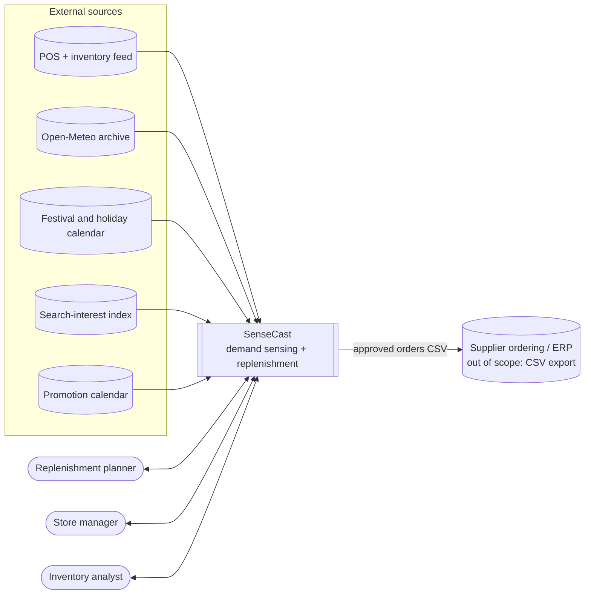
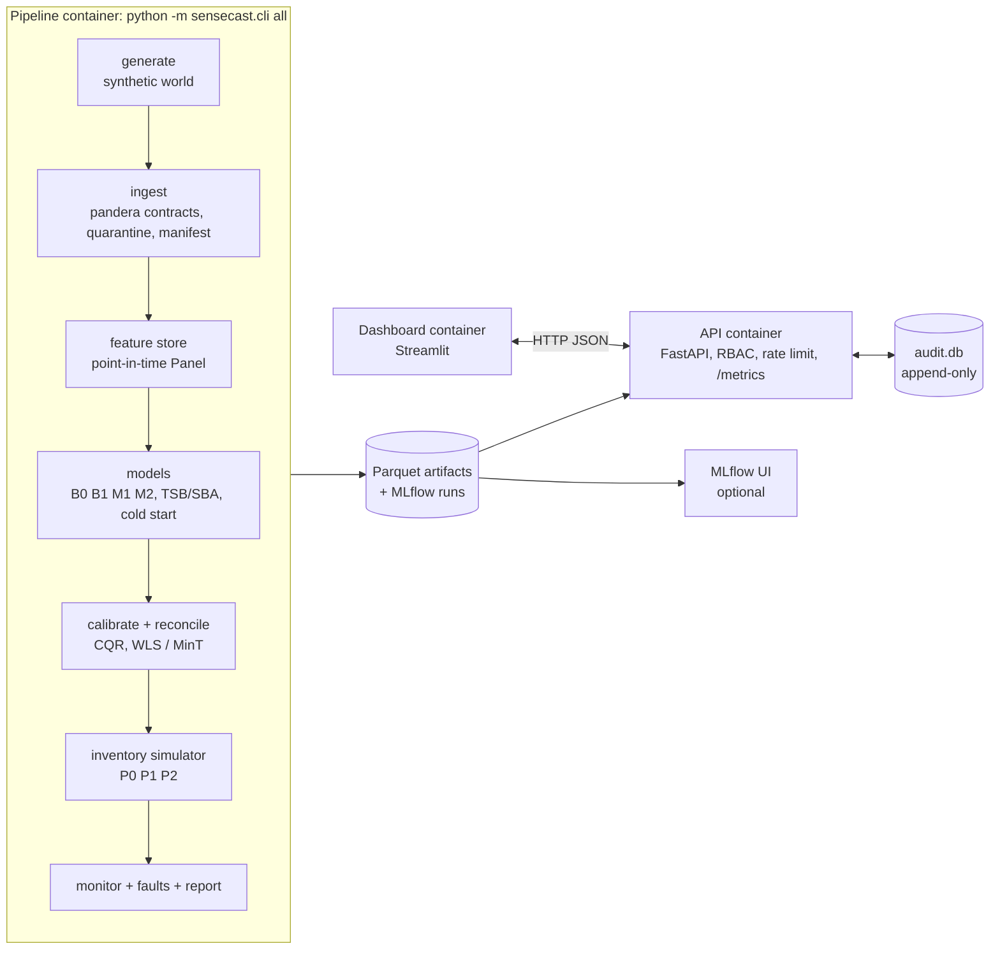
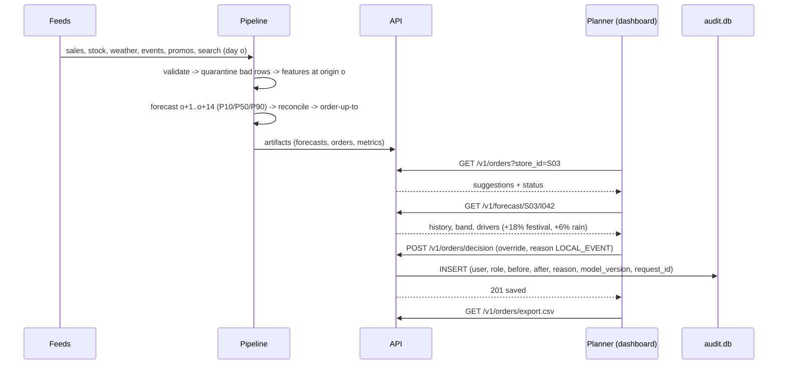
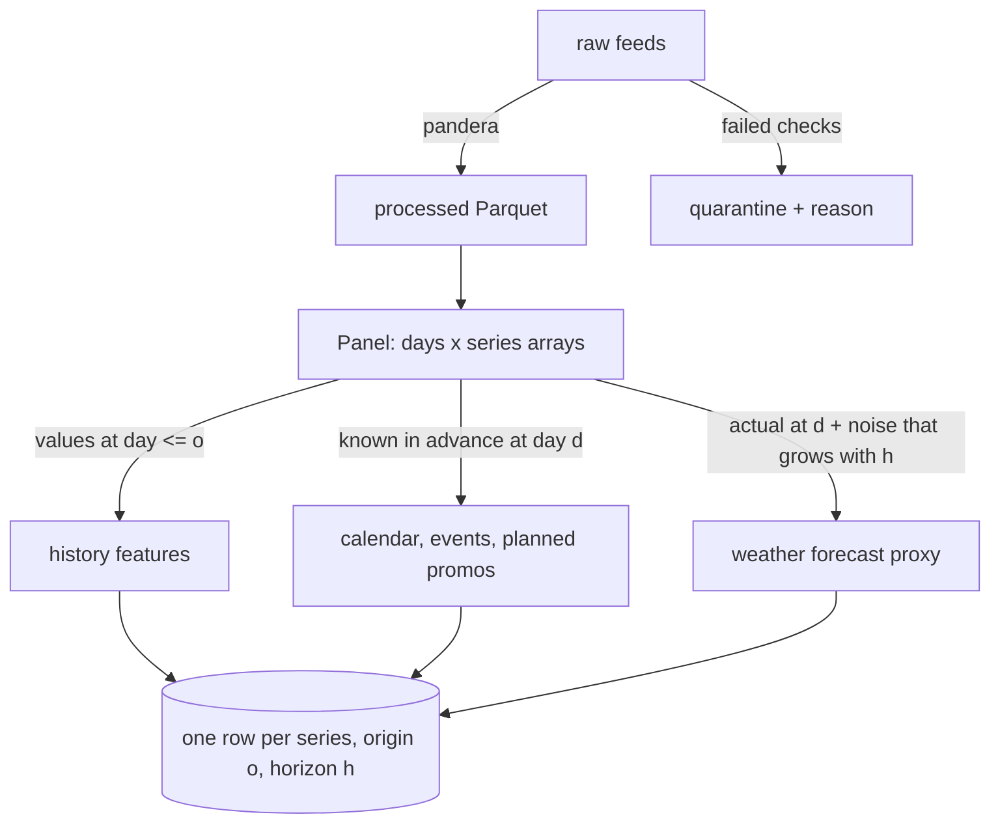

# Solution design pack

## 1. C4 level 1: system context

## 2. C4 level 2: containers

One image, three roles: the command decides whether a container runs the pipeline, the API or
the dashboard (`docker-compose.yml`).

## 3. Sequence: the evening order cycle

## 4. Data flow and point-in-time rule

A feature row for origin *o* and target day *d = o + h* may read observed data only up to day *o*.
Calendar, festivals and planned promotions are known in advance and may be read at *d*. Weather at
*d* is a forecast, never the observed value. `tests/leakage/` enforces all three.

## 5. Feature schema

| Family | Features | Read at |
|---|---|---|
| item/store | cat_idx, store_idx, region_idx, price_log, pack_size | static |
| history | last_obs, mean7, mean28, mean56, std28, zero28, sdw_mean4, days_since_sale, age | origin (stockout days masked) |
| calendar | h, dow, dom, month, woy | target day |
| events | days_to_event, event_id, in_festival, is_holiday | target day |
| promotion | disc, post_promo | target day (planned) |
| weather | temp_fc, rain_fc, hum_fc, wx_missing | target day, forecast proxy |
| search | search_o (5-day median), search_mean7, search_ratio (median/median), search_trend | origin |

M1 uses item/store + history + calendar. M2 adds events, promotion, weather and search.

## 6. Hierarchy

| Level | Nodes | Example |
|---|---|---|
| total | 1 | all stores |
| region | 3 | Mumbai, Pune, Nashik |
| store | 10 | S01 |
| store x category | 40 | S01 snacks |
| item x store | 1,500 | S01 I042 |

Summing matrix `S` is 1,554 x 1,500 (`features/panel.py::summing_matrix`).

## 7. Data contracts

Feed contracts are executable pandera schemas in `src/sensecast/ingest/schemas.py`. Key rules for the
sales feed: unique (date, store_id, item_id); `units_sold >= 0`; `unit_price > 0`; stock balance
`on_hand_open + receipts - units_sold == on_hand_close`; no dates after the business day; known item
and store keys. Rows that fail go to `data/quarantine/` with the reason; nothing is silently fixed.

## 8. API contract

The OpenAPI spec is generated from code: `make openapi` writes `docs/02-design/openapi.json`, and a
running API serves interactive docs at `/docs`.

| Method | Path | Purpose |
|---|---|---|
| GET | `/health` | liveness, model version, last data day |
| GET | `/metrics` | Prometheus metrics |
| GET | `/v1/stores`, `/v1/items?store_id=` | catalogue (store-scoped for managers) |
| GET | `/v1/forecast/{store_id}/{item_id}` | 60-day history, 14-day P10/P50/P90, drivers, model used |
| GET | `/v1/stores/{store_id}/forecast` | reconciled store and category forecasts |
| GET | `/v1/orders?store_id=&status=` | suggested orders with decision status |
| POST | `/v1/orders/decision` | approve / override / reject (reason required, guard at 10x) |
| GET | `/v1/orders/export.csv?store_id=` | CSV export, formula-injection safe |
| GET | `/v1/audit` | decision log |
| GET | `/v1/evaluation`, `/v1/simulation`, `/v1/monitoring` | evidence for the dashboard |

## 9. UI prototype

The Streamlit dashboard (`dashboard/app.py`) is the working prototype. Tabs:

1. **Overview**: headline metrics, go/no-go gates, model ladder.
2. **Forecasts**: store, category and item pickers; history + calibrated band; "what is moving this
   forecast" bar chart; reconciled category totals for the store.
3. **Orders**: suggestions with status counts; decision form (action, quantity, reason, note); CSV export.
4. **Inventory simulation**: policy table and lost-units trace.
5. **Monitoring**: PSI per feature with the alert line, weekly WAPE, store bias alerts, data freshness, fault-suite results.
6. **Audit log**.

Screenshots for the report: run `make up`, open http://localhost:8501.

## 10. Threat model (STRIDE)

| Threat | Where | Control | Evidence |
|---|---|---|---|
| **S**poofing identity | API | `api/auth.py` hook; header mode only behind a trusted gateway; unknown roles rejected | `test_rbac_in_header_mode` |
| **T**ampering with decisions | audit.db | append-only triggers; reason codes; override guard | `test_audit_log_is_append_only`, `test_decision_flow_and_audit` |
| **T**ampering with data | feeds | schema contracts, quarantine, SHA-256 manifest | `test_validate_sales_quarantines_every_defect` |
| **R**epudiation | decisions | user, role, time, before/after, model_version, request_id stored per decision | audit table schema |
| **I**nformation disclosure | API | store-scoped RBAC; no personal data in the system; secrets only via env (`.env` git-ignored); gitleaks in CI | RBAC test, CI job `secrets` |
| **D**enial of service | API | per-client token bucket (429), 64 KB payload cap, health exempt | `test_rate_limit` |
| **E**levation of privilege | API | analysts cannot decide; managers cannot cross stores | RBAC test |
| Supply chain | dependencies | pinned versions, `pip-audit` in CI, slim base image, non-root container user | CI job `test`, Dockerfile |
| Data poisoning | search / weather feeds | median-based search features, climatology fallback, drift alerts | fault suite |

## 11. Test strategy

| Layer | What | Where | Runs in |
|---|---|---|---|
| Unit | metrics, intermittent methods, reconciliation algebra, conformal coverage, contracts, event features | `tests/unit` | CI, every PR |
| Leakage | scrambled future, target not a feature, weather-as-forecast, block separation | `tests/leakage` | CI |
| Fault | outage fallback, spike damping, stockout masking, fault-suite outcomes | `tests/faults` | CI |
| Integration | full small pipeline end to end; API contract, validation, RBAC, audit, rate limit, CSV | `tests/integration` | CI |
| Smoke | `sensecast all --profile small` + container run | CI jobs `test`, `docker` | CI |
| Performance | API p95 latency under 8 concurrent clients | `make loadtest` | before release |
| Acceptance | go/no-go gates from `configs/default.yaml -> thresholds` | `sensecast report` | before release |
