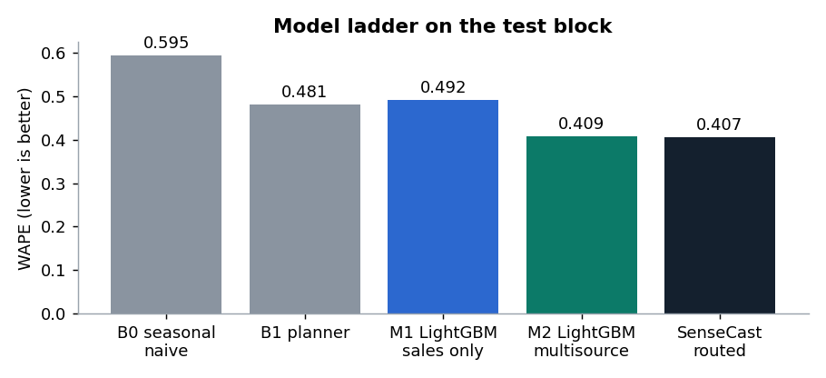
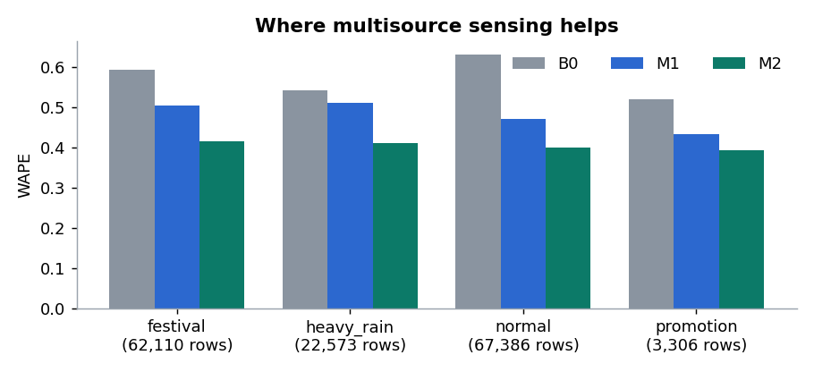
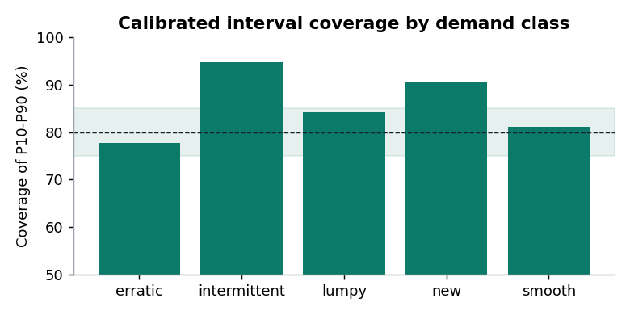
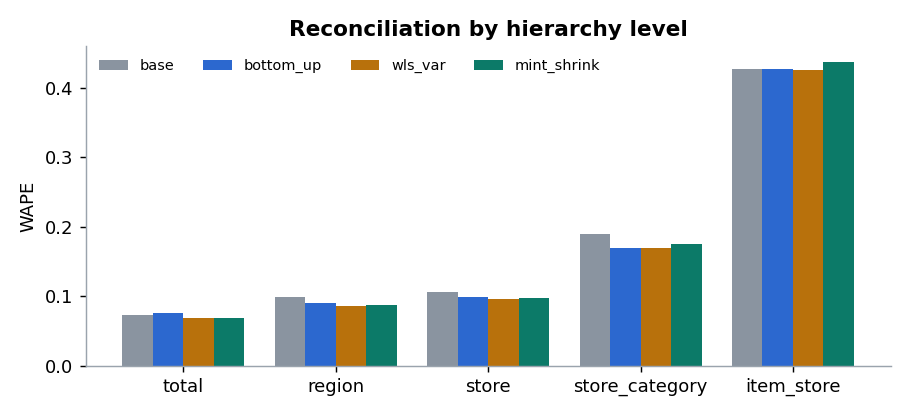
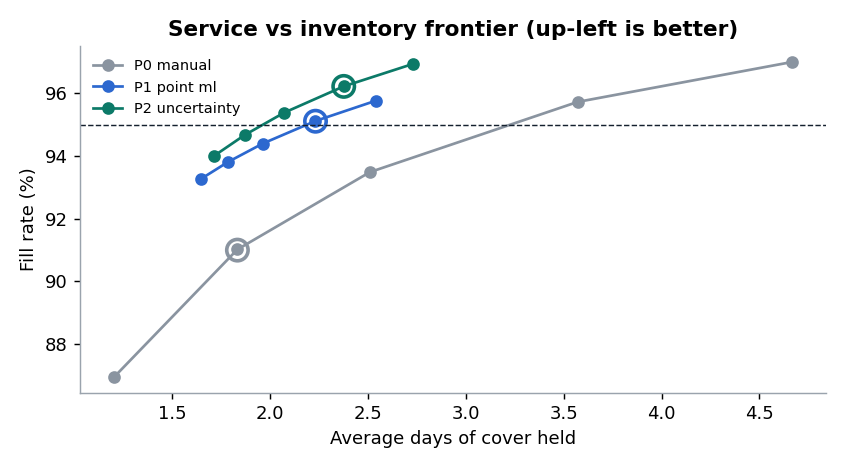
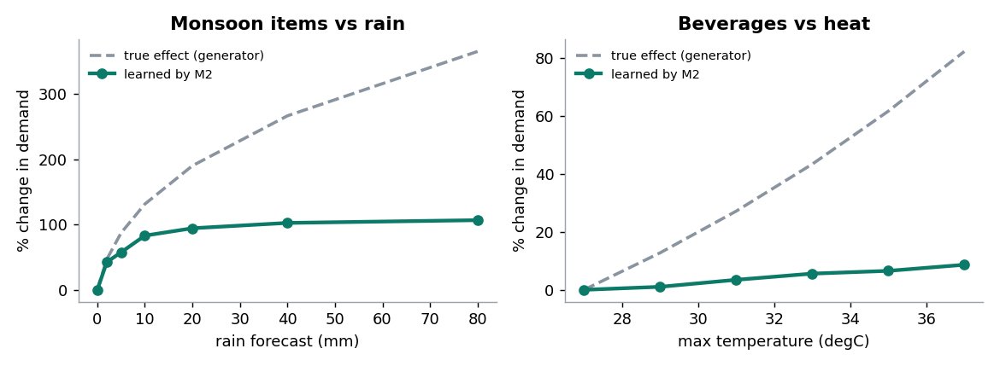
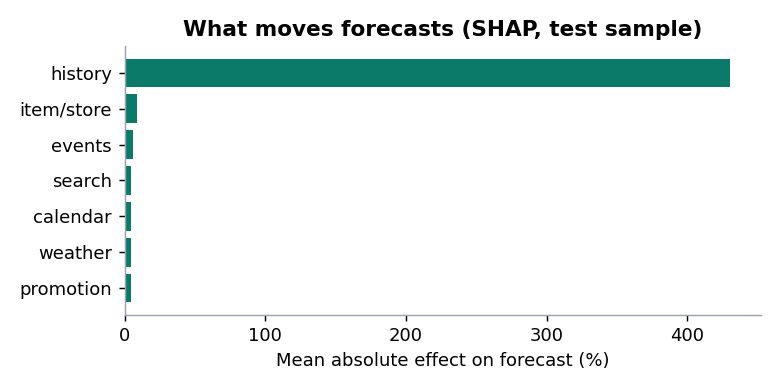
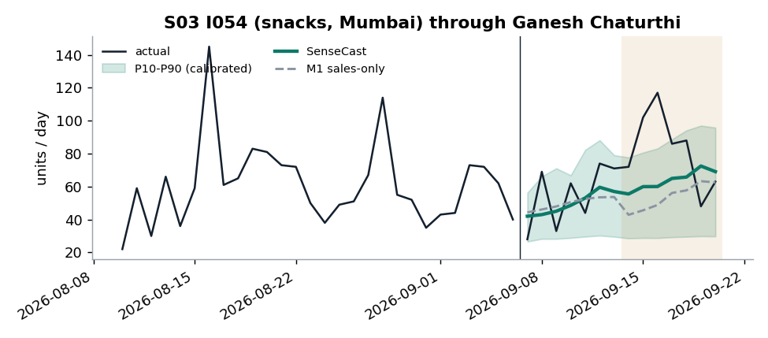

# Evaluation results (generated)

Generated by `sensecast report` from run `35644d5987a5` (profile `default`).
Test block: origins from 2026-07-19 to the last target day 2026-09-20.
Do not edit by hand; rerun the pipeline instead. The narrative lives in `evaluation_report.md`.

## Go / no-go gates: 13 of 15 pass

| gate | value | target | result |
|---|---|---|---|
| WAPE vs seasonal naive | 31.6% better | >= 10% better | PASS |
| MASE, store level | 0.933 | < 1.0 | PASS |
| Demand-sensing gain (festival + heavy-rain days) | 18.2% | >= 5% | PASS |
| Pinball loss vs planner quantiles | 13.8% better | >= 10% better | PASS |
| P10-P90 coverage | 85.6% | 75%-85% | FAIL |
| Intermittent + lumpy MASE | 0.997 | <= B0 (1.093) | PASS |
| Cold-start WAPE, first 28 days | 57.4% better | >= 10% better | PASS |
| Hierarchy coherence error | 0.0e+00 | < 1e-06 | PASS |
| Fill rate at 95% service target (P2) | 96.2% | >= 95% | PASS |
| Inventory needed for a 95% fill rate, P2 vs P0 | -39.2% | <= +0% | PASS |
| Stockout days vs manual policy | 61.1% fewer | >= 20% fewer | PASS |
| Forecast stability | 0.082 | <= 0.15 | PASS |
| Leakage probe (future scrambled) | 0 features changed | 0 | PASS |
| API latency p95 | not measured | < 300 ms | N/A |
| Full batch run | 5.6 min | < 10 min | PASS |

## Model ladder (item-store-day, test block, non-censored days)

| model | wape | mase | bias |
|---|---|---|---|
| b0 | 0.5951 | 1.1538 | 0.0283 |
| b1 | 0.4814 | 0.9874 | 0.0071 |
| m1 | 0.4919 | 1.0521 | 0.0093 |
| m2 | 0.4088 | 0.9474 | -0.0058 |
| final | 0.4068 | 0.8953 | -0.0106 |



## Accuracy by day type

| day type | b0 | b1 | m1 | m2 | final | rows |
|---|---|---|---|---|---|---|
| festival | 0.5936 | 0.4862 | 0.5037 | 0.4153 | 0.413 | 62110.0 |
| heavy_rain | 0.5416 | 0.4754 | 0.5109 | 0.4114 | 0.4099 | 22573.0 |
| normal | 0.6326 | 0.4822 | 0.4719 | 0.4011 | 0.3991 | 67386.0 |
| promotion | 0.5208 | 0.4404 | 0.4337 | 0.3939 | 0.3911 | 3306.0 |



## Accuracy by demand class

| class | b0 | b1 | m1 | m2 | final | rows |
|---|---|---|---|---|---|---|
| erratic | 0.7439 | 0.6021 | 0.591 | 0.4925 | 0.4925 | 36819.0 |
| intermittent | 1.3819 | 1.2575 | 1.3932 | 1.3553 | 1.2456 | 52857.0 |
| lumpy | 1.181 | 0.9941 | 1.0906 | 1.1218 | 0.9682 | 6415.0 |
| new | 0.5788 | 0.5711 | 0.564 | 0.5055 | 0.5055 | 8091.0 |
| smooth | 0.4303 | 0.3357 | 0.3643 | 0.2916 | 0.2916 | 51193.0 |

## Intervals

| forecast | pinball | coverage |
|---|---|---|
| b1 | 1.7136 | 0.8353 |
| final_raw | 1.4779 | 0.8479 |
| final_conformal | 1.4775 | 0.856 |



## Reconciliation (WAPE by level)

| level | base | bottom_up | mint_shrink | wls_var |
|---|---|---|---|---|
| total | 0.073 | 0.0761 | 0.0692 | 0.0686 |
| region | 0.0986 | 0.0894 | 0.087 | 0.0856 |
| store | 0.1062 | 0.0987 | 0.0969 | 0.0955 |
| store_category | 0.19 | 0.1699 | 0.175 | 0.1696 |
| item_store | 0.4265 | 0.4265 | 0.4376 | 0.4259 |

Shrinkage intensity lambda = 0.5092; base forecasts were incoherent by up to 4163 units; reconciled error 0.0e+00.



## Cold start (first 28 days of an item's life)

| catmean | m2 | c1 | final | rows |
|---|---|---|---|---|
| 1.1212 | 0.4774 | 1.0068 | 0.4774 | 1849 |

Routing chosen on the calibration block: {"intermittent": "sba", "lumpy": "tsb"}; new items -> `m2`.

## Inventory simulation

| policy | fill_rate | stockout_day_rate | stockout_days_per_series | avg_on_hand_units | avg_days_of_cover | overstock_units_per_day | lost_units_per_day | units_ordered_per_day | holding_cost_inr_per_day | lost_margin_inr_per_day | total_cost_inr_per_day |
|---|---|---|---|---|---|---|---|---|---|---|---|
| P0_manual | 0.9099 | 0.0769 | 4.3062 | 32342.8809 | 1.8325 | 1.2046 | 1590.0821 | 16104.3488 | 4528.4579 | 105953.2003 | 110481.6582 |
| P1_point_ml | 0.9511 | 0.0276 | 1.5456 | 39386.3077 | 2.2316 | 61.6369 | 863.4041 | 16781.2448 | 4822.3772 | 65016.7661 | 69839.1433 |
| P2_uncertainty | 0.9622 | 0.0299 | 1.6752 | 41932.9352 | 2.3759 | 5.5796 | 667.0359 | 16952.7498 | 6224.3117 | 44368.2332 | 50592.5449 |



## Does the model recover the true effects?



| grid | learned_pct | true_pct |
|---|---|---|
| 0.0 | 0.0 | 0.0 |
| 2.0 | 42.5 | 46.9 |
| 5.0 | 57.4 | 87.2 |
| 10.0 | 83.1 | 131.5 |
| 20.0 | 94.4 | 190.3 |
| 40.0 | 102.6 | 266.8 |
| 80.0 | 106.8 | 365.6 |

| grid | learned_pct | true_pct |
|---|---|---|
| 27 | 0.0 | 0.0 |
| 29 | 1.0 | 12.7 |
| 31 | 3.4 | 27.1 |
| 33 | 5.6 | 43.3 |
| 35 | 6.5 | 61.6 |
| 37 | 8.6 | 82.2 |

## Explainability



## Example



## Fault suite

```json
{
  "leakage_probe": {
    "origin": 1032,
    "features_checked": 36,
    "features_changed": [],
    "max_abs_change": 0.0,
    "passed": true
  },
  "weather_outage": {
    "wape_normal": 0.40878875909807466,
    "wape_outage": 0.4655476807514507,
    "wape_points_lost": 5.675892165337604,
    "wape_sales_only_m1": 0.4918895724299021,
    "wape_heavy_rain_normal": 0.4205435318650106,
    "wape_heavy_rain_outage": 0.43128601094673397,
    "rows_flagged": 167100,
    "rows_total": 167100,
    "passed": true
  },
  "search_spike": {
    "category": "snacks",
    "forecast_shift": 0.03034539520740509,
    "naive_feature_jump": 0.25667619705200195,
    "passed": true
  },
  "censoring_ablation": {
    "variants": {
      "ignore": {
        "bias_vs_true_demand": -0.0871696570793664,
        "bias_top10_vs_true_demand": -0.11247792813258961,
        "wape_vs_true_demand": 0.44514338727086655,
        "wape_vs_observed_sales": 0.4154805865367849
      },
      "drop": {
        "bias_vs_true_demand": -0.10083605631262622,
        "bias_top10_vs_true_demand": -0.11822059710229167,
        "wape_vs_true_demand": 0.444639494469422,
        "wape_vs_observed_sales": 0.4140122328954639
      },
      "impute": {
        "bias_vs_true_demand": -0.07586780565128308,
        "bias_top10_vs_true_demand": -0.10266715596712105,
        "wape_vs_true_demand": 0.44686630093632695,
        "wape_vs_observed_sales": 0.4189969748252865
      }
    },
    "least_biased": "impute",
    "used_in_production": "impute",
    "passed": true
  },
  "store_demand_drop": {
    "store": "S01",
    "injected_drop": 0.2,
    "weekly": [
      {
        "week": 1,
        "bias": 0.2107,
        "alert": true
      },
      {
        "week": 2,
        "bias": 0.1493,
        "alert": false
      },
      {
        "week": 3,
        "bias": 0.1178,
        "alert": false
      },
      {
        "week": 4,
        "bias": 0.1569,
        "alert": true
      },
      {
        "week": 5,
        "bias": 0.2904,
        "alert": true
      },
      {
        "week": 6,
        "bias": 0.346,
        "alert": true
      },
      {
        "week": 7,
        "bias": 0.268,
        "alert": true
      },
      {
        "week": 8,
        "bias": 0.2484,
        "alert": true
      }
    ],
    "detected_in_week": 1,
    "passed": true
  },
  "dirty_feed": {
    "quarantined": {
      "duplicate_key": 757,
      "negative_units": 151,
      "bad_price": 151,
      "date_in_future": 25
    },
    "injected": {
      "future_rows": 25
    },
    "passed": true
  }
}
```

## Monitoring

PSI alerts (> 0.2): hum_fc, search_mean7, search_o, search_ratio, search_trend, temp_fc
Store bias alerts: 2
